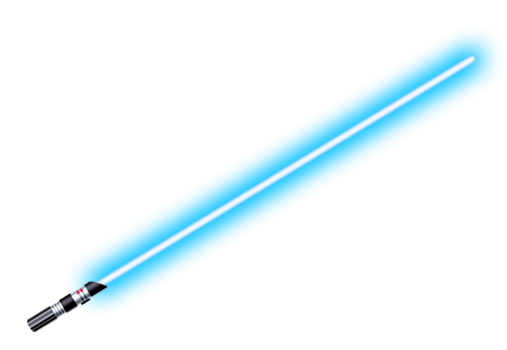

## Hello there 

I'm Joonas, here's some stuff about me:

- 🖥️Currently Working at CSC - Finland as an Application Specialist in Quantum Technologies
- 👨‍🎓Doing my Master's in Aalto University on Quantum Technologies
- 🔭 I’m currently working on Quantun Circuit Knitting (check out [QCut](https://github.com/FiQCI/QCut))
- 🔍 Find me on [LinkedIn](https://www.linkedin.com/in/joonasnivala/) or check out [jooniv.fi](https://www.jooniv.fi)

Cheers 👋

<!--
**JooNiv/JooNiv** is a ✨ _special_ ✨ repository because its `README.md` (this file) appears on your GitHub profile.

Here are some ideas to get you started:

- 🔭 I’m currently working on ...
- 🌱 I’m currently learning ...
- 👯 I’m looking to collaborate on ...
- 🤔 I’m looking for help with ...
- 💬 Ask me about ...
- 📫 How to reach me: ...
- 😄 Pronouns: ...
- ⚡ Fun fact: ...
-->
